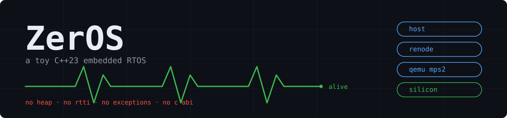

# ZerOS: A Toy C++23 Embedded RTOS



> Co-Apply for [Tutorial_AwesomeModernCPP](https://github.com/Awesome-Embedded-Learning-Studio/Tutorial_AwesomeModernCPP)
> 联动项目：[Tutorial_AwesomeModernCPP](https://github.com/Awesome-Embedded-Learning-Studio/Tutorial_AwesomeModernCPP)

[](https://github.com/Charliechen114514/ZerOS/actions/workflows/ci.yml)
[](https://en.cppreference.com/w/cpp/23)
[](https://developer.arm.com/processors/cortex-m3)

[](LICENSE)

[English](README.en.md) | **简体中文**

组件定位的 C++23 裸机 RTOS,面向 Cortex-M3——无堆、无 RTTI、无异常、无 C ABI。
一套内核,四处运行:桌面单测、Renode/QEMU 仿真,以及真机。

## 为什么这么写

- **RTOS 是组件,不是中心。** 应用只面向 `<ZerOS/*>` 头与 BSP 公开面,
  内核不认识任何板级寄存器;换板子不动内核。
- **裸机上能保留的全部 C++23:** concepts 约束接口、类型状态任务工厂、
  应用面 `std::expected`——热路径则保持朴素、静态、可数。
- **一套代码,四个目标:** host 单测 / Renode 仿真 / QEMU mps2-an385 / 真机。

## 内核里有什么

- 32 级抢占优先级 + 同级时间片轮转(位图 + CLZ)
- 毫秒级时间服务:`sleep_for` / 软件定时器 / 超时等待;动态 tick——空闲时
  SysTick 按下一到期点投 one-shot,中断次数降 99% 以上
- 同步族:信号量、互斥量(即时优先级继承)、消息队列(阻塞发送 + ISR 投递)、
  事件组(广播)、任务通知(单槽信箱)
- 工作队列(ISR 下半段)、日志通道、栈金丝雀 + 水位测量、HardFault 遗言
- 体积(demo 实测):核心内核数 KB,最大 demo ~6KB

## 快速上手

host 测试——只需要一个 C++ 编译器和 CMake:

```shell
cmake -B build-host -DZEROS_BUILD_TESTS=ON -DCMAKE_BUILD_TYPE=Debug
cmake --build build-host -j && ctest --test-dir build-host --output-on-failure
```

交叉构建进 Renode 一发(需 arm-none-eabi-gcc ≥ 14 与 Renode;
submodule 一次性初始化见 `third_party/README.md`):

```shell
cmake -B build -DCMAKE_TOOLCHAIN_FILE=cmake/arch/arm-none-eabi.cmake
cmake --build build --target run-heartbeat -j   # 编 + 仿真 + 看串口,一发
```

QEMU:

```shell
cmake --build build --target run-mps2-heartbeat -j
```

真机(ST-Link):

```shell
cmake --build build --target flash-heartbeat -j
```

## 示例

一场景一目录一行注册(`zeros_add_demo(<名>)`),每个示例自带 `run-<名>` 编跑目标。

| demo | 展示 |
|---|---|
| `heartbeat` | 两个任务一条心跳 |
| `blink` | 真机点灯 |
| `event_stream` | 定时器投流 + 真中断注入 |
| `inversion` | 优先级继承剧场 |
| `bottom_half` | 中断扔活,任务收尾 |
| `timers` | 软件定时器(单发 + 周期) |
| `events_notify` | 事件组与直发信箱 |
| `testaments` | 金丝雀与遗言 |
| `round_robin` | 双旋不让,公平分片 |
| `watermark` | 栈水位报表 |
| `tickless` | 动态 tick 实证(前后 tick 计数对照) |
| `perf` | 切换延迟实测(真机 DWT) |

## 布局

```
include/ZerOS/   公开 API,按子系统归位(kernel/sched、kernel/clock……)
src/kernel/      内核——host 上独立编译,零板级 include
src/system/      私有模板实现头
src/arch/        架构桥接(arm_cortex_m3、host)
src/log/         日志:格式化住在这里,永不进内核
src/board/       一板一包(bluepill、mps2_an385):适配层 + 链接脚本
                 + 仿真资产 + 示例
third_party/     CMSIS 头,经 sparse submodule 引入
documents/       工程笔记(性能实测册等)
```

## 许可

MIT,见 [LICENSE](LICENSE);`third_party/` 下的 CMSIS 器件头属 ST,
Apache-2.0,经 git submodule 引入。
